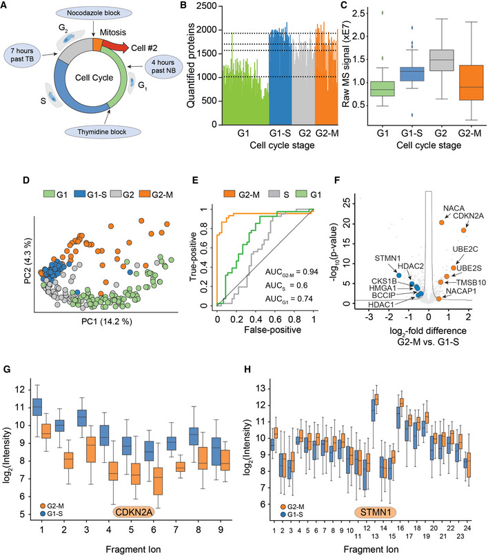
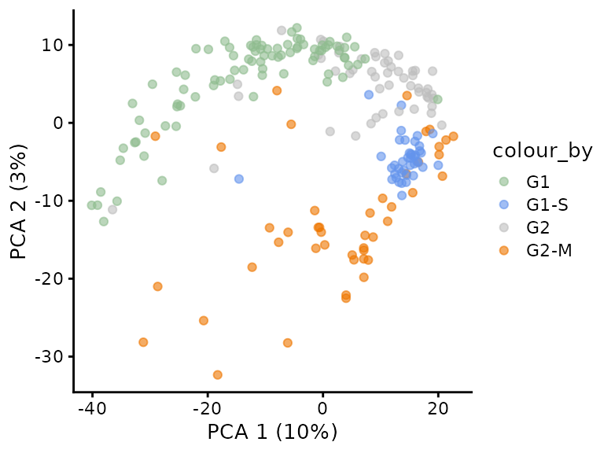
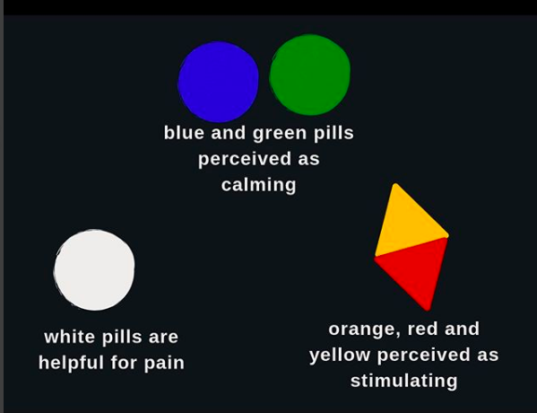
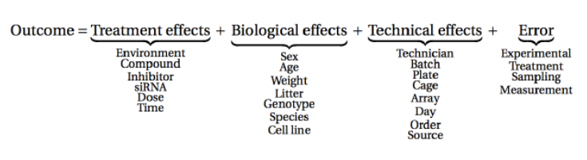
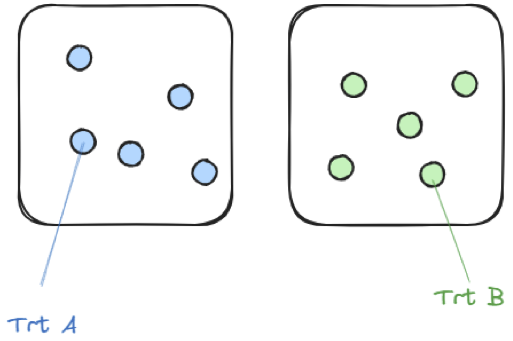
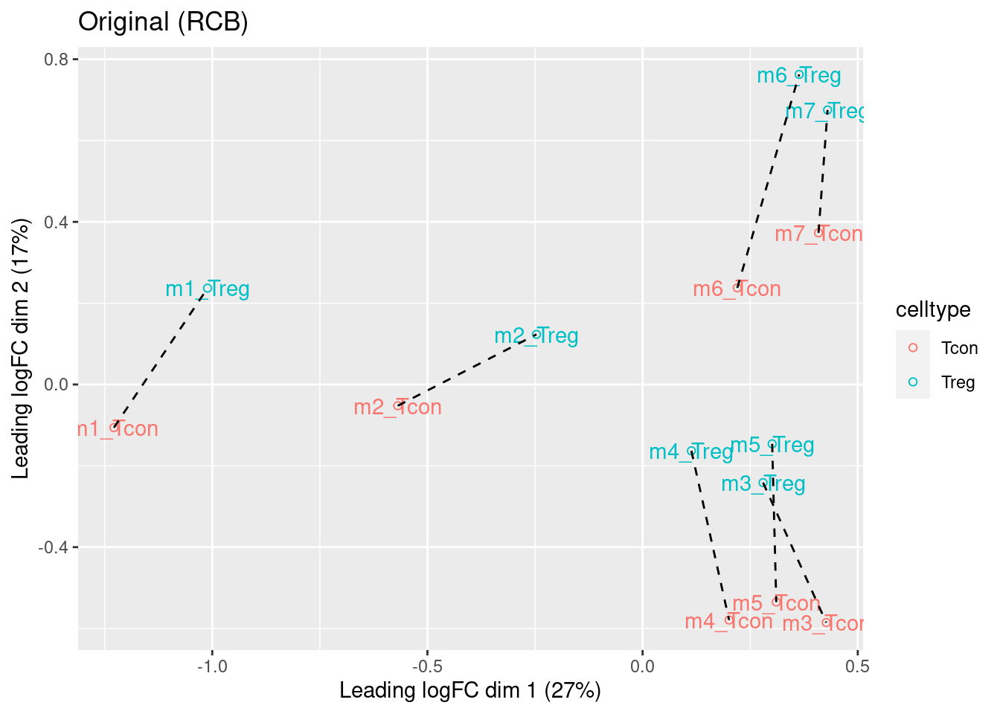
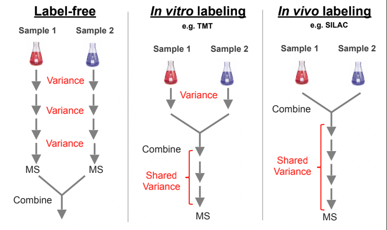

```{r setup, include=FALSE, cache=FALSE}
knitr::opts_chunk$set(
  include = TRUE, comment = NA, echo = TRUE,
  message = FALSE, warning = FALSE, cache = TRUE
)
library(tidyverse)
if(!requireNamespace("NHANES", quietly = TRUE)) {install.packages("NHANES")}
library(Rfast)
library(NHANES)
library(gridExtra)
```

<a rel="license" href="https://creativecommons.org/licenses/by-nc-sa/4.0"></a>

# Motivating example (Brunner et al. 2022) 



Brunner et al. 2022. Mol Syst Biol. 18(3): e10798. doi: 10.15252/msb.202110798

- Single cell study on 231 HeLa cells with drug induced cell cycle arrest for which over 2500 proteins where measured with MS-SCP. 
- Authors report:  

"The proteomes of the different cell cycle states grouped together in a principal component analysis (PCA) plot". 

"Our single‐cell data set also highlighted proteins not previously associated with the cell cycle and the G2/M transition"

## Reanalysis of the results

We could reproduce the results: 



Another way to look at the same plot


<details><summary> What happened </summary><p>

Confounding between acquisition batch and cell cycle arrest!!

To consult the statistician after an experiment is finished is often merely to ask him to conduct a post mortem examination. He can perhaps say what the experiment died of. -- Ronald Fisher

</p></details>


Thinking about design before your experiment is key!!!!

# Stages of an experiment

```{r out.width='80%',fig.asp=.8, fig.align='center',echo = FALSE, warning = FALSE, message = FALSE}
if ("pi" %in% ls()) rm("pi")
kopvoeter <- function(x, y, angle = 0, l = .2, cex.dot = .5, pch = 19, col = "black") {
  angle <- angle / 180 * pi
  points(x, y, cex = cex.dot, pch = pch, col = col)
  lines(c(x, x + l * cos(-pi / 2 + angle)), c(y, y + l * sin(-pi / 2 + angle)), col = col)
  lines(c(x + l / 2 * cos(-pi / 2 + angle), x + l / 2 * cos(-pi / 2 + angle) + l / 4 * cos(angle)), c(y + l / 2 * sin(-pi / 2 + angle), y + l / 2 * sin(-pi / 2 + angle) + l / 4 * sin(angle)), col = col)
  lines(c(x + l / 2 * cos(-pi / 2 + angle), x + l / 2 * cos(-pi / 2 + angle) + l / 4 * cos(pi + angle)), c(y + l / 2 * sin(-pi / 2 + angle), y + l / 2 * sin(-pi / 2 + angle) + l / 4 * sin(pi + angle)), col = col)
  lines(c(x + l * cos(-pi / 2 + angle), x + l * cos(-pi / 2 + angle) + l / 2 * cos(-pi / 2 + pi / 4 + angle)), c(y + l * sin(-pi / 2 + angle), y + l * sin(-pi / 2 + angle) + l / 2 * sin(-pi / 2 + pi / 4 + angle)), col = col)
  lines(c(x + l * cos(-pi / 2 + angle), x + l * cos(-pi / 2 + angle) + l / 2 * cos(-pi / 2 - pi / 4 + angle)), c(y + l * sin(-pi / 2 + angle), y + l * sin(-pi / 2 + angle) + l / 2 * sin(-pi / 2 - pi / 4 + angle)), col = col)
}

par(mar = c(0, 0, 0, 0), mai = c(0, 0, 0, 0))
plot(0, 0, xlab = "", ylab = "", xlim = c(0, 10), ylim = c(0, 10), col = 0, xaxt = "none", yaxt = "none", axes = FALSE)
rect(0, 6, 10, 10, border = "red", lwd = 2)
text(.5, 8, "population", srt = 90, col = "red", cex = 2)
symbols(3, 8, circles = 1.5, col = "red", add = TRUE, fg = "red", inches = FALSE, lwd = 2)
set.seed(330)
grid <- seq(0, 1.3, .01)

for (i in 1:50)
{
  angle1 <- runif(n = 1, min = 0, max = 360)
  angle2 <- runif(n = 1, min = 0, max = 360)
  radius <- sample(grid, prob = grid^2 * pi / sum(grid^2 * pi), size = 1)
  kopvoeter(3 + radius * cos(angle1 / 180 * pi), 8 + radius * sin(angle1 / 180 * pi), angle = angle2)
}
text(7.5, 8, "Effect of drug on \n proteome in population", col = "red", cex = 1.2)

rect(0, 0, 10, 4, border = "blue", lwd = 2)
text(.5, 2, "sample", srt = 90, col = "blue", cex = 2)
symbols(3, 2, circles = 1.5, col = "red", add = TRUE, fg = "blue", inches = FALSE, lwd = 2)
for (i in 0:1) {
  for (j in 0:4)
  {
    kopvoeter(2.1 + j * (3.9 - 2.1) / 4, 1.1 + i / 2, col = "purple")
  }
}
for (i in 2:3) {
  for (j in 0:4)
  {
    kopvoeter(2.1 + j * (3.9 - 2.1) / 4, 1.6 + i / 2, col = "orange")
  }
}
text(7.5, 2, "Effect of drug on \n proteome in sample", col = "blue", cex = 1.2)

arrows(3, 5.9, 3, 4.1, col = "black", lwd = 3)
text(1.5, 5, "EXP. DESIGN (1)", col = "black", cex = 1.2)
text(7.5, .5, "DATA EXPLORATION &\nDESCRIPTIVE STATISTICS (2)", col = "black", cex = 1.2)
arrows(7, 4.1, 7, 5.9, col = "black", lwd = 3)
text(8.5, 5, "ESTIMATION &\nINFERENCE (3)", col = "black", cex = 1.2)
```

## Stages 

1. Define hypothesis
2. Experimental design
  
    - Population
    - Technology
    - Lab protocol
    - Think about sources of variation 
    - Choice of Design
    - Experimental conditions
    - Replicates
    - How will we analyse the data
    - How can we translate our research question in a quantity that we can measure 
    - Power analysis
  
3. Conduct experiment
4. Data Analysis

    - QC
    - Preprocessing & Data exploration
    - Statistical inference
    
5. Optimisation of your experiment (go back to 2)
6. Validation
7. Report your results

Always good to discuss with statistician before the experiment! 


# Sources of variability 

## Experimental unit 

- Animal, subject, plant, culture, cage to which the treatment is randomized
- Colony (B)
- Strain (B)
- Culture (B)
- Treatment / Condition of interest (B)
- Cage (T)
- Sex (B)
- Individual (B)
- Life style (B)
- ...


## Sample prep 

- Organs from sacrificed animal (B)
- Single cells (B)
- Runs for Dissociation, Extraction and Digestion (T) 
- Multipipet / pipeting robot (T)
- Plate (T)
- Position on plate (T)

## Proteomics acquisition

- LC column (T)
- Run (T)
- Technical repeat (T)
- Labeling (T)
- Acquisition order
- ...

## Observational unit

- Unit on which the measurement is conducted 
- Cell
- Cell bulk
- Animal 
- If observational unit $\neq$ experimental unit: pseudoreplication

## Avoid confounding

- Random sampling & Randomisation 
- Blocking


# Random Sampling & Randomisation

## Random Sampling

- Random sampling is closely related to the concept of the population or the scope of the study.

- Based on a sample of subjects, the researchers want to come to conclusions that hold for

    - all kinds of people
    - only male students

- Scope of the study should be well specified before the start of the study.

- Representative sample: For the statistical analysis to be valid, it is required that the subjects are selected completely at random from the population to which we want to generalize our conclusions.

- Selecting completely at random from a population implies:
    - all subjects in the population should have the same probability of being selected in the sample,
    - the selection of a subject in the sample should be independent from the selection of the other subjects in the sample.

## Randomisation 

- Make sure that groups are comparable / Avoid systematic differences between groups
- Randomisation: treatments of interest are attributed at randam to the experimental units

## Consequences of Random sampling & Randomisation 

- The sample is thus supposed to be representative for the population, but still it is random.

- What does this imply?


### National Health NHanes study

  - Since 1960 individuals of all ages are interviewed in their homes every year
  - The health examination component of the survey is conducted in a mobile examination centre (MEC).
  - We will use this large study to select random subjects from the American population.
  - This will help us to understand how the results of an analysis and the conclusions vary from sample to sample.

```{r}
nhanesSub <- NHANES %>%
  filter(Age >= 18 & !is.na(Height)) %>%
  select(c("Gender","Height"))

nhanesSub %>% 
  ggplot(aes(x = Height)) +
  geom_histogram() +
  facet_grid(Gender ~ .) +
  xlab("Height (cm)")
```

```{r echo = FALSE, warning = FALSE, message = FALSE}
HeightSum <- nhanesSub %>%
  group_by(Gender) %>%
  summarize_at("Height",
               list(mean = mean,
               sd = sd)
              )

knitr::kable(
  HeightSum %>%
  mutate_if(is.numeric, round, digits=1)
  )
```


- Data bell-shaped 
- Allows us to summarize data with two statistics: mean and standard deviation 

Unfortunately we cannot sample entire population!
We have to draw conclusions based on a small sample. 


### Experiment 


- We can simulate an experiment on the American population by sampling from the NHANES study 
- 5 males and 5 females above 18 years. 


```{r echo = FALSE, warning = FALSE, message = FALSE}
set.seed(200)
fem <- nhanesSub %>%
  filter(Gender == "female") %>%
  sample_n(size = 5)
mal <- nhanesSub %>%
  filter(Gender == "male") %>%
  sample_n(size = 5)

samp <- rbind(fem, mal)

samp %>%
  ggplot(aes(x = Gender, y = Height)) +
  geom_boxplot(outlier.shape = NA) +
  geom_point(position = "jitter")

samp %>%
  group_by(Gender) %>%
  summarize(
    mean = mean(Height, na.rm = TRUE),
    sd = sd(Height, na.rm = TRUE),
    n = n()
  ) %>%
  mutate(se = sd / sqrt(n))
```

Note that the sample mean is different from that of the large experiment ("population") we sampled from.

We test for the difference between Males and females

```{r}
t.test(Height ~ Gender, samp, var.equal = TRUE)
```

### Repeat experiment 

If we do the experiment again we select other people and we obtain different results.


```{r echo = FALSE, warning = FALSE, message = FALSE}

fem <- nhanesSub %>%
  filter(Gender == "female") %>%
  sample_n(size = 5)
mal <- nhanesSub %>%
  filter(Gender == "male") %>%
  sample_n(size = 5)

samp <- rbind(fem, mal)


samp %>%
  ggplot(aes(x = Gender, y = Height)) +
  geom_boxplot(outlier.shape = NA) +
  geom_point(position = "jitter")

samp %>%
  group_by(Gender) %>%
  summarize(
    mean = mean(Height, na.rm = TRUE),
    sd = sd(Height, na.rm = TRUE),
    n = n()
  ) %>%
  mutate(se = sd / sqrt(n))

t.test(Height ~ Gender, samp, var.equal = TRUE)
```

### And again 


```{r echo = FALSE, warning = FALSE, message = FALSE}
seed <- 88605
set.seed(seed)
fem <- nhanesSub %>%
  filter(Gender == "female") %>%
  sample_n(size = 5)
mal <- nhanesSub %>%
  filter(Gender == "male") %>%
  sample_n(size = 5)

samp <- rbind(fem, mal)


samp %>%
  ggplot(aes(x = Gender, y = Height)) +
  geom_boxplot(outlier.shape = NA) +
  geom_point(position = "jitter")

samp %>%
  group_by(Gender) %>%
  summarize(
    mean = mean(Height, na.rm = TRUE),
    sd = sd(Height, na.rm = TRUE),
    n = n()
  ) %>%
  mutate(se = sd / sqrt(n))

t.test(Height ~ Gender, samp, var.equal = TRUE)
```


## Summary

- We drew at random different subjects in each sample
- As a result, length measurements vary from sample to sample.
- So do the estimated means and standard deviations.
- Consequently, our conclusions are also uncertain and may change from sample to sample.

- For the length example, samples where the effect is opposite to that in the population and where we decide that the difference is significant are rare.

$\rightarrow$ With statistics, we control for the probability of drawing wrong conclusions.


# Control of Decision Errors 

We have two types of errors: 

- false negatives: there is an effect but we do not pick it up
- false positives: there is no effect but we report a difference between both groups

## Control of false negatives


- We repeat the experiment with 5 females and 5 males 10000 times. 

```{r echo =FALSE}
set.seed(15152)
# Aantal simulaties en steekproefgrootte per groep
nSim <- 10000
nSamp <- 5

# We filteren de data vooraf zodat we dit niet telkens opnieuw hoeven te doen
fem <- nhanesSub %>%
  filter(Gender == "female")

mal <- nhanesSub %>%
  filter(Gender == "male")

# Simulatie studie
# Om snelle functies te kunnen gebruiken nemen we eerst nSim steekproeven en berekenen we daarna alles.

femSamps <- malSamps <-matrix(NA, nrow=nSamp, ncol=nSim)
for (i in 1:nSim)
{
  femSamps[,i] <- sample(fem$Height, nSamp)
  malSamps[,i] <- sample(mal$Height, nSamp)
}

res <- data.frame(
  verschil=colMeans(femSamps) - colMeans(malSamps),
  Rfast::ttests(femSamps, malSamps)
  )


res %>%
  ggplot(aes(x=verschil,y=-log10(pvalue),color=pvalue < 0.05)) +
  geom_point() +
  xlab("Average height difference (cm)") +
  ylab("Statistical Significance (-log10 p)")

falseNeg5Box <- res %>%
  ggplot(aes(y = verschil)) +
  geom_boxplot() +
  ylab("Average height difference (cm)")
  xlab("")

falseNeg5Box
```

- There are `r sum(res$pvalue < 0.05 & res$verschil < 0)` samples for which we return a true positive $\rightarrow$ The power is `r round(mean(res$pvalue < 0.05 & res$verschil < 0)*100,1)`%.
- There are `r sum(res$pvalue > 0.05)` samples for which we cannot report a significant difference. 
- There are `r  sum(res$pvalue < 0.05 & res$verschil>0)` for which we report a significant height difference between females and males that is positive.


- The sample that we have shown where we concluded that females were larger than males was very unlikely. We had to draw `r format(seed,digits=5)` samples before we were able to find such an extreme sample. 

- Why do we have a considerable number of samples for which we do not find a significant height difference between males and females? 

### Larger sample size 

When we take 20 subjects in each group: 

```{r echo =FALSE}
set.seed(15152)
# Aantal simulaties en steekproefgrootte per groep
nSim <- 10000
nSamp <- 20

# We filteren de data vooraf zodat we dit niet telkens opnieuw hoeven te doen
fem <- nhanesSub %>%
  filter(Gender == "female")

mal <- nhanesSub %>%
  filter(Gender == "male")

# Simulatie studie
# Om snelle functies te kunnen gebruiken nemen we eerst nSim steekproeven en berekenen we daarna alles.

femSamps <- malSamps <-matrix(NA, nrow=nSamp, ncol=nSim)
for (i in 1:nSim)
{
  femSamps[,i] <- sample(fem$Height, nSamp)
  malSamps[,i] <- sample(mal$Height, nSamp)
}

res <- data.frame(
  verschil=colMeans(femSamps) - colMeans(malSamps),
  Rfast::ttests(femSamps, malSamps)
  )


res %>%
  ggplot(aes(x=verschil,y=-log10(pvalue),color=pvalue < 0.05)) +
  geom_point() +
  xlab("Average height difference (cm)") +
  ylab("Statistical Significance (-log10 p)")

falseNeg20Box <- res %>%
  ggplot(aes(y = verschil)) +
  geom_boxplot() +
  ylab("Average height difference (cm)")
  xlab("")
  
falseNeg20Box
```


Larger sample size: 

- Larger power to pick up a real difference in the population. 
- Mean is more precise 

```{r echo=FALSE, warning=FALSE, message=FALSE}
grid.arrange(falseNeg5Box + ggtitle("n1 = n2 = 5") + ylim(-40,10),falseNeg20Box + ggtitle("n1 = n2 = 20") + ylim(-40,10),nrow=1)
```


## Control of false positives

- Suppose that we set up an experiment with two groups that are both sampled from the females in the NHANES study
- Both groups come from the same population: so no difference

- We again draw repeated experiments with 5 subjects in each group. 


```{r echo = FALSE, warning = FALSE, message = FALSE}
set.seed(1324)
# Aantal simulaties en steekproefgrootte per groep
nSim <- 10000
nSamp <- 5

# We filteren de data vooraf zodat we dit niet telkens opnieuw hoeven te doen
fem <- nhanesSub %>%
  filter(Gender == "female")

# Simulatie studie
# Om snelle functies te kunnen gebruiken nemen we eerst nSim steekproeven en berekenen we daarna alles.

femSamps <- femSamps2 <-matrix(NA, nrow=nSamp, ncol=nSim)
for (i in 1:nSim)
{
  femSamps[,i] <- sample(fem$Height, nSamp)
  femSamps2[,i] <- sample(fem$Height, nSamp)
}

res <- data.frame(
  verschil=colMeans(femSamps) - colMeans(femSamps2),
  Rfast::ttests(femSamps, femSamps2)
  )


res %>%
  ggplot(aes(x=verschil,y=-log10(pvalue),color=pvalue < 0.05)) +
  geom_point() +
  xlab("Average height difference (cm)") +
  ylab("Statistical Significance (-log10 p)")

falsePos5Box <- res %>%
  ggplot(aes(y = verschil)) +
  geom_boxplot() +
  ylab("Average height difference (cm)")
  xlab("")
  
falsePos5Box
```

- Only in `r sum(res$pvalue<0.05)` out of `r format(nSim,digits=5)` samples we conclude that the mean in both groups are different or in `r round(mean(res$pvalue<0.05)*100,1)`% of the samples.

- With the statistical analysis we can control the number of false positive results correctly at the 5% significance level. 

### Larger sample size 

We perform the simulations again with 20 subjects in each group. 


```{r echo = FALSE, warning = FALSE, message = FALSE}
set.seed(1324)
# Aantal simulaties en steekproefgrootte per groep
nSim <- 10000
nSamp <- 20

# We filteren de data vooraf zodat we dit niet telkens opnieuw hoeven te doen
fem <- nhanesSub %>%
  filter(Gender == "female")

# Simulatie studie
# Om snelle functies te kunnen gebruiken nemen we eerst nSim steekproeven en berekenen we daarna alles.

femSamps <- femSamps2 <-matrix(NA, nrow=nSamp, ncol=nSim)
for (i in 1:nSim)
{
  femSamps[,i] <- sample(fem$Height, nSamp)
  femSamps2[,i] <- sample(fem$Height, nSamp)
}

res <- data.frame(
  verschil=colMeans(femSamps) - colMeans(femSamps2),
  Rfast::ttests(femSamps, femSamps2)
  )


res %>%
  ggplot(aes(x=verschil,y=-log10(pvalue),color=pvalue < 0.05)) +
  geom_point() +
  xlab("Average height difference (cm)") +
  ylab("Statistical Significance (-log10 p)")

falsePos20Box <- res %>%
  ggplot(aes(y = verschil)) +
  geom_boxplot() +
  ylab("Average height difference (cm)")
  xlab("")

falsePos20Box
```


- Only in `r sum(res$pvalue<0.05)` out of `r format(nSim,digits=5)` samples we conclude that the mean in both groups are different or in `r round(mean(res$pvalue<0.05)*100,1)`% of the samples.


- So with the statistical analysis, also when taking a large sample, we correctly control the number of false positive results at 5%.

- The mean difference is again more accurately estimated (fluctuating less around the real difference of 0). 


```{r echo=FALSE, warning=FALSE, message=FALSE}
grid.arrange(falsePos5Box + ggtitle("n1 = n2 = 5") + ylim(-20,20),falsePos20Box + ggtitle("n1 = n2 = 20") + ylim(-20,20),nrow=1)
```


# Control treatment

Captopril study: SBP before and after dosign captopril.

```{r echo=FALSE, message=FALSE, warning=FALSE}
captopril <- read.table("https://raw.githubusercontent.com/statOmics/sbc/master/data/captopril.txt",header=TRUE,sep=",")
captoprilTidy <- captopril %>% gather(type,bp,-id)
capto1 <- captoprilTidy %>%
  filter(type%in%c("SBPa","SBPb")) %>%
  mutate(type=factor(type,levels=c("SBPb","SBPa"))) %>%
  ggplot(aes(x=type,y=bp)) +
  geom_line(aes(group = id)) +
  geom_point()

delta <- captopril$SBPa-captopril$SBPb
captopril$deltaSBP <- delta
capto2 <- captopril %>%
  ggplot(aes(x="Systolic blood pressure",y=deltaSBP)) +
  geom_boxplot(outlier.shape=NA) +
  geom_point(position="jitter")+
  ylab("Difference (mm mercury)") +
  xlab("")

grid.arrange(capto1, capto2, nrow=1)

with(captopril, t.test(
             SBPa,
             SBPb,
             paired=TRUE))

```
```{r}
sd(captopril$SBPb)
sd(captopril$SBPa)
sd(captopril$deltaSBP)
```

pre-test/post-test experiment

- Advantage?
- Problem?

---



Good control is nessecary 

$\rightarrow$ Placebo controlled double blind experiments     
$\rightarrow$ Injection of control animal with blank containing same solvents, etc. 

# Replication


Within an experiment: Enables to estimate uncertainty / biological variability

- Replication is essential for quantifying the noise

- Noise: biological and technical in nature

Between experiments: Any true finding should be reproducible


## At which level do we have to replicate? 

- Genuine replicates include all sources of variability: technical + biological
- Technical replicates are important if you assess new technologies



## Pseudoreplication

- Samples are not independent e.g.
    
    - Same batch of reagents
    - Same 96-well plate
    - Leaves from the same plant
    - Cells from the same plate
    - Mice in the same cage or from the same litter
    - Spatially/chronally clustered together (wells on plate, all trt A measured before trt B)

- Try to avoid pseudo-replication: samples are not independent 

    - Contain less info than genuine replicates
    - If analysed as if they were independent $\rightarrow$ increased number of false positives
    - If not possible e.g. in a multi-subject single cell context, pseudo-replication typically occurs and has to be accounted in the analysis! 
    - Consult statistician


## Francisella tularensis study Ramond et al. (2015)

- Proteome of wild type F. tularensis (WT) vs ArgP-gene deleted F. tularensis (knock-out, D8).
- Each bio-rep in technical triplicate on MS
- Illustration with 50S ribosomal proteïn L5 A0Q4J5

```{r echo = FALSE, warning = FALSE, message = FALSE}
franc <- read_tsv("https://raw.githubusercontent.com/statOmics/PSLS21/data/francisellaA0Q4J5.txt")
franc %>% 
  ggplot(aes(biorep, intensityLog2, color = genotype)) +
  geom_point()
```

- If we analyse original data with a t-test we act as if we would have 9 genuine repeats in each condition 

- Effect of interest between bio-reps so no block design

- Same number of technical repeats for each genuine repeat we can first average over the techreps. 

- If that is not the case more complex data analysis methods have to be used, e.g. mixed models!

- **Caution: never average over genuine repeats/experimental units!!!**

### Correct analysis 

```{r}
lmBiorep <- lm(intensityLog2 ~ -1 + biorep, franc)
francSum <- data.frame(genotype = rep(c("D8","WT"),each=3) %>% as.factor %>% relevel("WT"), intensityLog2 = lmBiorep$coef)
francSum
t.test(intensityLog2 ~ genotype, francSum, var.equal=TRUE)
```

### Wrong analysis

```{r echo = FALSE, warning = FALSE, message = FALSE}
t.test(intensityLog2 ~ genotype, franc,var.equal=TRUE)
```

- Result much more significant because we erroneously act as if we have a 9 by 9 comparison. 

### Simulation under $H_0$

- We use data to estimate variance components: technical and biological variance. 
- We simulate 10000 experiments with similar design from a normal distribution under the assumption that group means are the same. 
- We analyse them with both designs

```{r echo = FALSE, warning = FALSE, message = FALSE}
sigmaWithin <- sigma(lmBiorep)
lmSum <- lm(intensityLog2 ~ genotype, francSum)
sigmaBetween <- sigma(lmSum)
xBiorep <- model.matrix(~-1+biorep,franc)
xWrong <- model.matrix(~genotype,franc)


set.seed(2523)
nSim <- 10000
resWrong <- matrix(NA,nSim,4) %>% as.data.frame
names(resWrong) <- c("Estimate","Std. Error","t value","pvalue")
resCorrect <- resWrong
genotype <- franc$genotype
genotypeSum <- francSum$genotype
biorep <- franc$biorep

for (i in 1:nSim)
{
biorepSim <- rnorm(ncol(xBiorep),sd=sigmaBetween)
ySim <- xBiorep%*%biorepSim + rnorm(nrow(xBiorep),sd=sigmaWithin)
ySum <- lm(ySim~biorep)$coefficient
resWrong[i,] <- summary(lm(ySim~genotype))$coefficient[2,]
resCorrect[i,]<-summary(lm(ySum~genotypeSum))$coefficient[2,]
}
```

Probability on a false positive when using a 5% significance level in 

- correct analysis:
```{r}
mean(resCorrect$pvalue < 0.05)
```

- wrong analysis: 

```{r}
mean(resWrong$pvalue < 0.05)
```

- We no-longer control the false positives at the $\alpha = 5$% level!
- We report to much false positives! 

## How many genuine replicates? 

- For experimental studies: look at randomisation of treatment 
- Double blind study with 20 sputum positive patients randomized to treatment or placebo
- Mouse study (10 mice)

{width=25%}

- Mouse study (30 mice)

{width=25%}{width=25%}{width=25%}    

- Mouse study (10 mice)

{width=25%}


# Blocking 

- Isolate known sources of variability from the experiment
- One of the most powerful concepts of experimental design
- Nature methods: Points of significance - Blocking 

[https://www.nature.com/articles/nmeth.3005.pdf](https://www.nature.com/articles/nmeth.3005.pdf)

## Example

```{r echo = FALSE, warning = FALSE, message = FALSE, out.width="50%"}
knitr::include_graphics("./figures/mouseTcell_RCB_design.png")
```

```{r echo = FALSE, warning = FALSE, message = FALSE, out.width="100%"}

```

# Implications of different technologies


Slide courtesy (Lisa Breckels)


# Power analysis

- How many replicates do we need? 
- Differs for different experimental designs
- Requires knowledge of total variability / magnitude of sources of variability
- Use literature or pilot experiment
- Can be done using simulations

## Mouse example

- In 2021 Choa et al. published that the cytokine Thymic stromal lymphopoietin (TSLP) induced fat loss through sebum secretion (talg). [[html](https://www.science.org/doi/full/10.1126/science.abd2893)] [[PDF](https://www.science.org/doi/pdf/10.1126/science.abd2893)]


- Suppose that you would like to set up a similar study to test if cytokine interleukin 25 (IL) also has beneficial effect.

- You plan to setup a study with a control group of high fat diet (HFD) fed mice and a treatment group that recieves the HFD and IL.

- What sample size do you need to pick up the effect of the treatment.

## How will we analyse the data of this experiment?

- Two groups: two sample t-test

$H_0$: The average weight difference is equal to zero    
$H_1$: The average weight difference is different from zero

Power? Is design specific. For two-group comparison it depends on 

- Real weight difference between the group means.
- Variability of the weight measurements
- Significance level $\alpha$
- Sample size in both groups

We can estimate the power if

- The assumptions of the model are met: weights are normally distributed with same variance

and we know

- Standard deviation of the weight measurements around their average mean for HFD-fed mice
- Real effect size in the population
- Sample sizes in each group 

## Use data from a previous experiment to get insight in mice data

- Suppose that we have access to the data of a preliminary experiment (e.g. provided by Karen Svenson via Gary Churchill and Dan Gatti and partially funded by P50 GM070683 on PH525x)

```{r echo = FALSE, warning = FALSE, message = FALSE}
mice <- read.csv("https://raw.githubusercontent.com/genomicsclass/dagdata/master/inst/extdata/femaleMiceWeights.csv")

mice %>%
  ggplot(aes(x = Diet, y = Bodyweight)) +
  geom_boxplot(outlier.shape = FALSE) +
  geom_jitter()


mice %>%
  ggplot(aes(sample = Bodyweight)) +
  geom_qq() +
  geom_qq_line() +
  facet_wrap(~Diet)

mice <- mice %>% mutate(Diet = as.factor(Diet))
miceSum <- mice %>%
  group_by(Diet) %>%
  summarize(
    mean = mean(Bodyweight, na.rm = TRUE),
    sd = sd(Bodyweight, na.rm = TRUE),
    n = n()
  ) %>%
  mutate(se = sd / sqrt(n))
miceSum
```

In the experiment we have data from two diets:

- Regular diet of cerial and grain based diet (Chow)
- High Fat (hf)

We can use the hf mice as input for our power analysis.

- The data of hf mice seem to be normally distributed
- The mean weight is 26.8g
- The SD of the weight is 4.1g

### Effect size?

- The alternative hypothesis is complex.
- It includes all possible effects!
- In order to do the power analysis we will have to choose a minimum effect size that we would like to detect.

- Suppose that we would like to pick up a weight change of at least 10%.

```{r}
delta <- abs(round(miceSum$mean[2] * .1, 1))
delta
```

### Simulation based power analysis

We can use simulations to assess the power. 

- E.g. for a 3 by 3 comparison where there is a weight difference of 3g. 
- We simulate 3 observations from a normal with mean 26.8g and sd 4.1g and 3 observations from a normal with mean 29.8g and sd 4.1g. 
- We perform a t-test and assess if we can conclude that there is a significant difference in the average weight between both groups based on this sample
- We repeat it many times and calculate the probability to find a significant difference. 

We can repeat the same procedure for many different sample sizes... 


```{r echo = FALSE, warning = FALSE, message = FALSE}
n1 <- n2 <- 3

sd <- round(miceSum$sd[2], 1)
predictorData <- data.frame(Diet = rep(c("c", "hf"), c(n1, n2)) %>% as.factor())

alpha <- 0.05


simFast <- function(form, data, betas, sd, contrasts, alpha = .05, nSim = 10000) {
  ySim <- rnorm(nrow(data) * nSim, sd = sd)
  dim(ySim) <- c(nrow(data), nSim)
  design <- model.matrix(form, data)
  ySim <- ySim + c(design %*% betas)
  ySim <- t(ySim)

  ### Fitting
  fitAll <- limma::lmFit(ySim, design)

  ### Inference
  varUnscaled <- c(t(contrasts) %*% fitAll$cov.coefficients %*% contrasts)
  contrasts <- fitAll$coefficients %*% contrasts
  seContrasts <- varUnscaled^.5 * fitAll$sigma
  tstats <- contrasts / seContrasts
  pvals <- pt(abs(tstats), fitAll$df.residual, lower.tail = FALSE) * 2
  return(mean(pvals < alpha))
}

nSim <- 20000
b0 <- 0
sd <- round(miceSum$sd[2], 1)
ns <- c(3, 5, 10, 20, 25, 50, 75, 100)
deltas <- c(1, 2, 3, 5, 10)

contrast <- limma::makeContrasts("Diethf", levels = c("(Intercept)", "Diethf"))

powerFast <- matrix(NA, nrow = length(ns) * length(deltas), ncol = 3) %>% as.data.frame()
names(powerFast) <- c("b1", "n", "power")
form <- ~Diet

i <- 0

for (n in ns)
{
  n1 <- n2 <- n

  ### Simulation
  predictorData <- data.frame(Diet = rep(c("c", "hf"), c(n1, n2)) %>% as.factor())

  for (b1 in deltas)
  {
    i <- i + 1
    betas <- c(b0, b1)
    powerFast[i, ] <- c(b1, n, simFast(form, predictorData, betas, sd, contrasts = contrast, alpha = alpha, nSim = nSim))
  }
}

powerFast[powerFast$b1==3,2:3]
```

We can also repeat that for different effect sizes 

```{r echo = FALSE, warning = FALSE, message = FALSE}
powerFast$delta <- as.factor(powerFast$b1)
powerFast %>%
  ggplot(aes(x = n, y = power, col = delta)) +
  geom_line()
```

